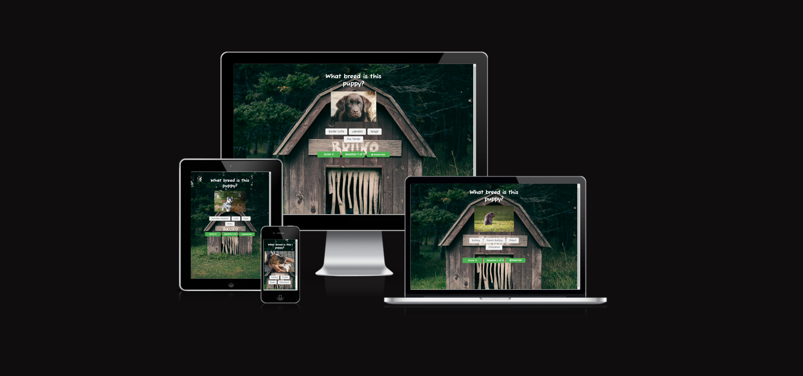
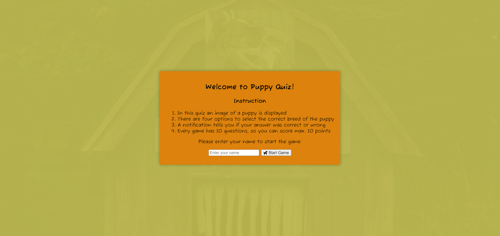
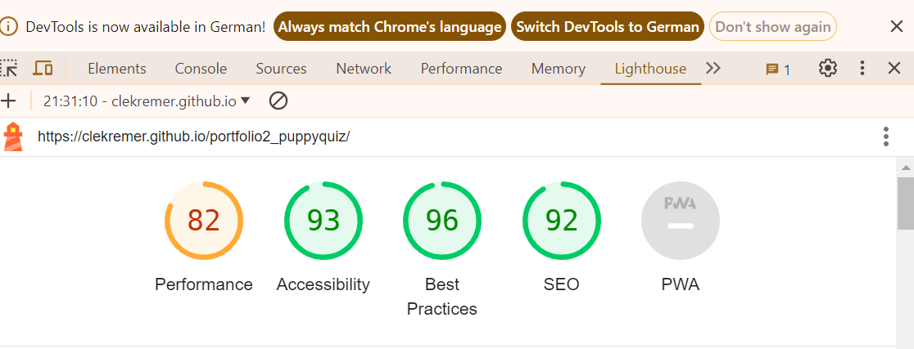

# Puppy Quiz - What breed is this puppy?

This site is a quiz for children, who like puppies. The user should identify the breed of the dog based on the puppy image. For each correct answer he earns a score. The quiz can be repeated by the same user multiple times. Each time a random sequence of question is generated. 

## User Stories
- As a user I want to sign in my name and start the game. 
- As a user I want to execute the game and easily understand the rules supported by the UI. 
- As a user I want to get feedback if my answer was correct or wrong. 
- As a user I want to see my current score and final result.
- As a user I want to see how many question I already have answered and how many questions are left to answer. 
- As a user I want to have the possibility to repeat the game with a new random set of questions.

## Design

### Imagery
The imagery should animate the user to play the quiz. It should give a context to the questions and should make fun to the user to watch it.

### Colours
The colours should give a warm, earthed and natural impression. Colors like red and green should give a clear feedback if the answer was wrong or correct.

## Wireframe

Wireframes were created with Balsamiq.

Desktop Wireframe

Mobile Wireframe

## Features

__Popup__

- The Popup is the starting screen for the quiz
- It contains the instructions for the quiz, a input field the enter the name of the player and the start game game button
- The popup is loaded by refreshing the page
- The quiz is reseted and starting by refreshing the page

__Question area__
  - In the question area of the quiz the following elements are displayed:
    - The question "What breed is this puppy?"
    - The image of the puppy for which the user should guess the correct breed

__Answer options area__

  - This page gives information about the methods and skills of the therpist 
  - It should give a first impression to the visitor what kind of person and treatments they can expect

 

__Notifications area__
  - Interested visitor can book an appointment or ask any question to the therapist

__Controls area__
 
 - On each page we provide links to social media where more information can be found
 
 

## Testing

### Validator Testing

- HTML, no errors were returned from the official W3C Markup Validator:
  - [W3C Validator Results](https://validator.w3.org/nu/?doc=https%3A%2F%2Fclekremer.github.io%2Fportfolio1_osteopathyKremer%2F)

- CSS, showed no errors or warnings:
[W3C CSS Validator Results](https://jigsaw.w3.org/css-validator/validator?uri=https%3A%2F%2Fclekremer.github.io%2Fportfolio1_osteopathyKremer%2Findex.html&profile=css3svg&usermedium=all&warning=1&vextwarning=&lang=de)
    
 - Acessibility score through the lighthouse 100%
 

The page was tested after deployment on mobile phone, laptop, desktop and tablet pad for responsiveness and functionality and on different browsers (Chrome, Firefox, Edge). No bugs were found. 

### Form Testing
- The form was tested successfully. It only can be submitted with all required fiels and email address. It give feedback when fields are empty or no email address was used.

### Links Testing
- all internal and external links were tested successfully 

    
### Device Testing
- responsiveness for different screen sizes was tested successfully on laptop, desktop and mobile (Samsung S20) and with [Am I Responsive](https://ui.dev/amiresponsive?url=https://clekremer.github.io/portfolio1_osteopathyKremer/)

## Bugs encountered

No known bugs.

## Deployment

This section describes how the code was deployed

-The site was deployed on GitHub pages by executing the following steps
  - In GitHub repository clicking on settings menu, then in side menu "pages"
  - In source dropdown select "deploy from branch"
  - In branch dropdown select "main" and "root"
  - After clicking on save the url for the website will be displayed as soon as the deployment is done a few minutes later and after refreshing the page

  The live link can be found [here](https://clekremer.github.io/portfolio1_osteopathyKremer/index.html)
  
## Technologies used
__Main Languages__

-  [HTML5](https://en.wikipedia.org/wiki/HTML5)
-  [CSS](https://en.wikipedia.org/wiki/CSS)

__Frameworks, Libraries & Programs Used__
- [Gitpod](https://www.gitpod.io/) was used for developing the code as IDE, commiting and pusing code to repository
- [Github](https://github.com/) was using for storing repositories, and deployment via github pages
- [Am I responsive](http://ami.responsivedesign.is/) was used to check the responsiveness of the site, and create a mock-up images to be used for this page
- [Jigsaw](https://jigsaw.w3.org/css-validator/) validator was used to check the CSS code for errors and warnings
- [W3C](https://validator.w3.org/) validator was used to check the HTML5 code for errors and warnings
- Google Chrome's lighthouse was used to check performance, accesibility and tips on how to improve the user experience and performance

## Credits 

I used sniplets of code from the [love running](https://code-institute-org.github.io/love-running-2.0/index.html) example: footer, header and navigation menu 

Content ideas were used from "Osteopathie Kremer Jena" my own Homepage: [Osteopathie Kremer](https://www.osteopathie-jena.net/)

Images were made in my own Osteopathy practice. The photograph was Nikolaus Brade: http://nikolausbrade.de/

## Acknowlegements

Thanks to my mentor Antonio for his support and feedback.