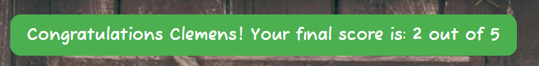

# Puppy Quiz - What breed is this puppy?

This site is a quiz for children, who like puppies. The user should identify the breed of the dog based on the puppy image. For each correct answer he earns a score. The quiz can be repeated by the same user multiple times. Each time a random sequence of question is generated. 

## User Stories
- As a user I want to sign in my name and start the game. 
- As a user I want to execute the game and easily understand the rules supported by the UI. 
- As a user I want to get feedback if my answer was correct or wrong. 
- As a user I want to see my current score and final result.
- As a user I want to see how many question I already have answered and how many questions are left to answer. 
- As a user I want to have the possibility to repeat the game with a new random set of questions.

## Design

### Imagery
The imagery should animate the user to play the quiz. It should give a context to the questions and should make fun to the user to watch it.

### Colours
The colours should give a warm, earthed and natural impression. Colors like red and green should give a clear feedback if the answer was wrong or correct.

## Wireframe

Wireframes were created with Balsamiq.

Desktop Wireframe

Mobile Wireframe

## Features

__Popup__

- The Popup is the starting screen for the quiz
- It contains the instructions for the quiz, a input field the enter the name of the player and the start game game button
- The popup is loaded by refreshing the page
- The quiz is reseted and starting by refreshing the page

__Question area__
  - In the question area of the quiz the following elements are displayed:
    - The question "What breed is this puppy?"
    - The image of the puppy for which the user should guess the correct breed

__Answer options area__

  - In this area 4 answer options are displayed as buttons
  - For each question the user can click one time on one button

 

__Notifications area__
  - In this area the notifications are displayed as feedback to answers given by the user
  - There are 3 notifications:
    1. Correct answer notification
    2. Wrong answer notification
    3. End of game notification 
  - notifications disappear automatically after 2 sec

__Controls area__
 
  -  The controls area consists of 3 elements:
      - actual score
      - answered questions of total questions (should give overview about quiz progress)
      - button to restart the quiz
 
 

## Testing

### Validator Testing

- HTML, no errors were returned from the official W3C Markup Validator:
  - [W3C Validator Results](https://validator.w3.org/nu/?doc=https%3A%2F%2Fclekremer.github.io%2Fportfolio2_puppyquiz%2F)

- CSS, showed no errors or warnings:
[W3C CSS Validator Results](https://jigsaw.w3.org/css-validator/validator?uri=https%3A%2F%2Fclekremer.github.io%2Fportfolio2_puppyquiz%2F&profile=css3svg&usermedium=all&warning=1&vextwarning=&lang=de)

- JS, showed no errors; warnings are not relevant as ES6 is available
[JSHint Results](docs/readme_images/jshint_1.PNG)
[JSHint Results](docs/readme_images/jshint_2.PNG)
    
 - Acessibility score through the lighthouse 93%
 

The page was tested after deployment on mobile phone, laptop, desktop and tablet pad for responsiveness and functionality and on different browsers (Chrome, Firefox, Edge). No bugs were found. 

    
### Device Testing
- responsiveness for different screen sizes was tested successfully on laptop, desktop and mobile (Samsung S20) and with [Am I Responsive](https://ui.dev/amiresponsive?url=https://clekremer.github.io/portfolio2_puppyquiz/)

## Bugs encountered

No known bugs.

## Deployment

This section describes how the code was deployed

-The site was deployed on GitHub pages by executing the following steps
  - In GitHub repository clicking on settings menu, then in side menu "pages"
  - In source dropdown select "deploy from branch"
  - In branch dropdown select "main" and "root"
  - After clicking on save the url for the website will be displayed as soon as the deployment is done a few minutes later and after refreshing the page

  The live link can be found [here](https://clekremer.github.io/portfolio2_puppyquiz/)
  
## Technologies used
__Main Languages__

-  [HTML5](https://en.wikipedia.org/wiki/HTML5)
-  [CSS](https://en.wikipedia.org/wiki/CSS)
-  [Javascript](https://en.wikipedia.org/wiki/JavaScript)

__Frameworks, Libraries & Programs Used__
- [Gitpod](https://www.gitpod.io/) was used for developing the code as IDE, commiting and pusing code to repository
- [Github](https://github.com/) was using for storing repositories, and deployment via github pages
- [Am I responsive](http://ami.responsivedesign.is/) was used to check the responsiveness of the site, and create a mock-up images to be used for this page
- [Jigsaw](https://jigsaw.w3.org/css-validator/) validator was used to check the CSS code for errors and warnings
- [W3C](https://validator.w3.org/) validator was used to check the HTML5 code for errors and warnings
- Google Chrome's lighthouse was used to check performance, accesibility and tips on how to improve the user experience and performance
- [JSHint] (https://jshint.com/)validator was used to check JavaScript errors and warnings
- [FontAwesome](https://fontawesome.com/)
- [GoogleFonts](https://fonts.google.com/)

## Credits 

I used as idea for the basic html structure the basic structure from the love maths project 

I used for the shuffle Array function code sniplets from https://stackoverflow.com/questions/2450954/how-to-randomize-shuffle-a-javascript-array

Images for the puppy image and the background I took from:
- https://pxhere.com
- https://www.pexels.com
- https://unsplash.com
- https://pixabay.com

With thanks to the below artists:
- Wannes de Mol > Shepherd
- Leah Newhouse > Poodle
- Ayla Verschueren > Golden Retriever
- Helena Lopes > Labrador
- Erik McLean > Doghouse

## Acknowlegements

Thanks to my mentor Antonio for his support and feedback.